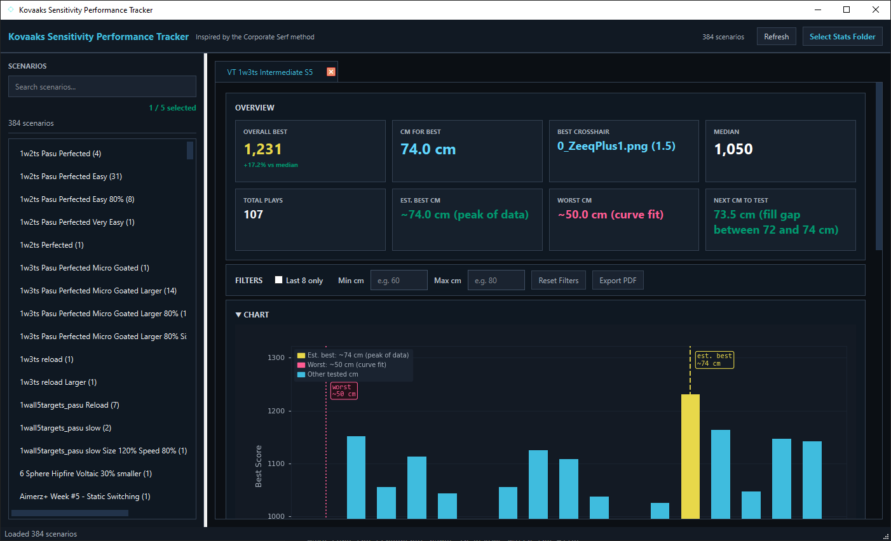
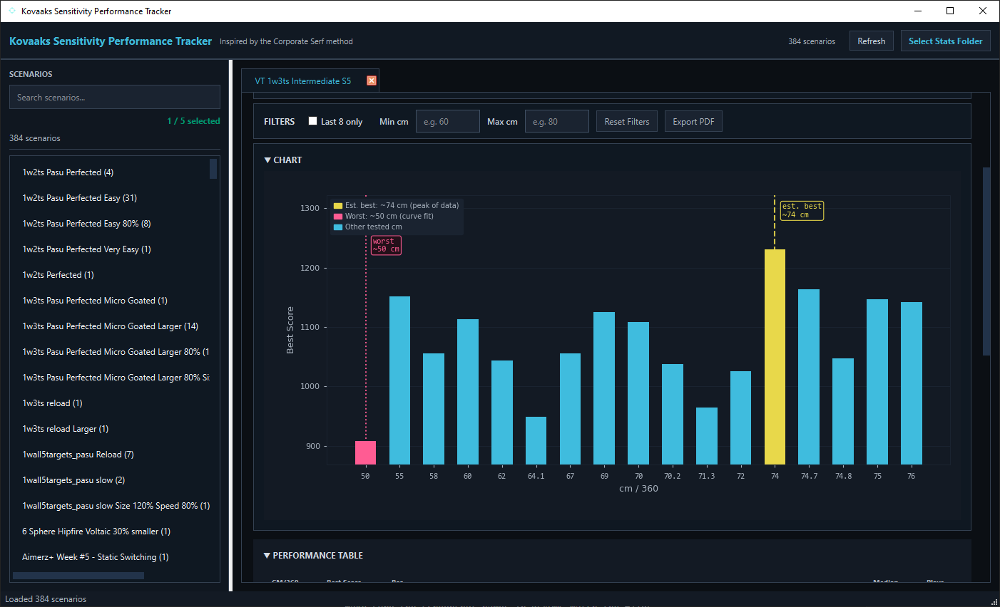
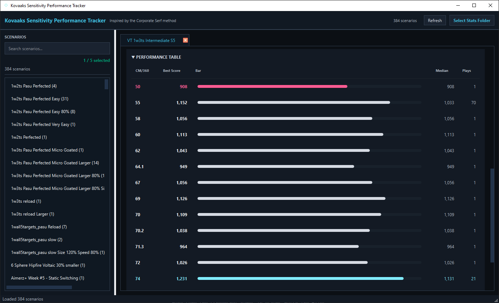

# Mouse Sensitivity Performance Tracker

Desktop application for analyzing KovaaK’s sensitivity training data.

This tool parses KovaaK’s stats, groups runs by scenario, and helps identify optimal sensitivities through summary stats, charts, and recommendations.

## Features

- Load a KovaaK’s stats folder and group runs by scenario
- Compare best score, median, total plays, best/worst cm/360, and next sensitivity to test
- View performance through embedded charts and a detailed table
- Filter results using last 8 runs and min/max cm ranges
- Export scenario analysis to PDF
- Persist local app state for repeat analysis workflows

## Screenshots

### Main Analysis View


### Chart View


### Performance Table


## Installation

### Option 1: Run packaged executable (Windows)

Download the latest release and run:

```bash
KovaaksSensTracker.exe
```

### Option 2: Run from source

```bash
py -m pip install -r requirements.txt
py main.py
```

## Build (Windows)

```bash
py -m PyInstaller --noconfirm --onedir --windowed --icon=assets/app_icon.ico --add-data "assets/app_icon.ico;assets" --name "KovaaksSensTracker" main.py
```

## Tech Stack

* Python
* PySide6
* Matplotlib
* ReportLab
* SQLite
* PyInstaller

## Project Structure

```text
kovaaks-sens-tracker/
  corporate_serf_tracker/
    analysis.py
    constants.py
    formatting.py
    parsing.py
    storage.py
    ui/
  assets/
    screenshots/
    app_icon.ico
  main.py
  requirements.txt
```

## Why I Built It

The Corporate Serf method is based on the idea that training aim scenarios at different sensitivities in KovaaK’s can expose specific weaknesses.

For example:

* weaker low-sensitivity performance may indicate weaker shoulder-driven aiming
* weaker high-sensitivity performance may point to weaker fingertip or fine-control aim

The original workflow required manually entering results into a Google Sheet after every scenario run. This app was built as a desktop alternative to remove that friction and make sensitivity analysis faster, repeatable, and easier to interpret.

## Notes

Inspired by the Corporate Serf sensitivity method. This project focuses on reducing manual tracking and making sensitivity analysis easier to repeat and interpret.