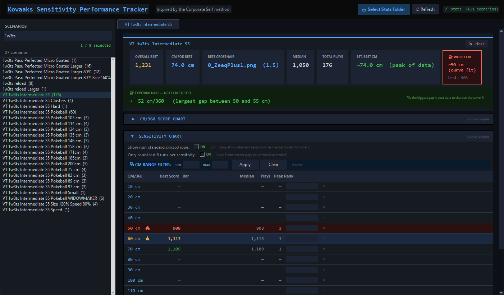
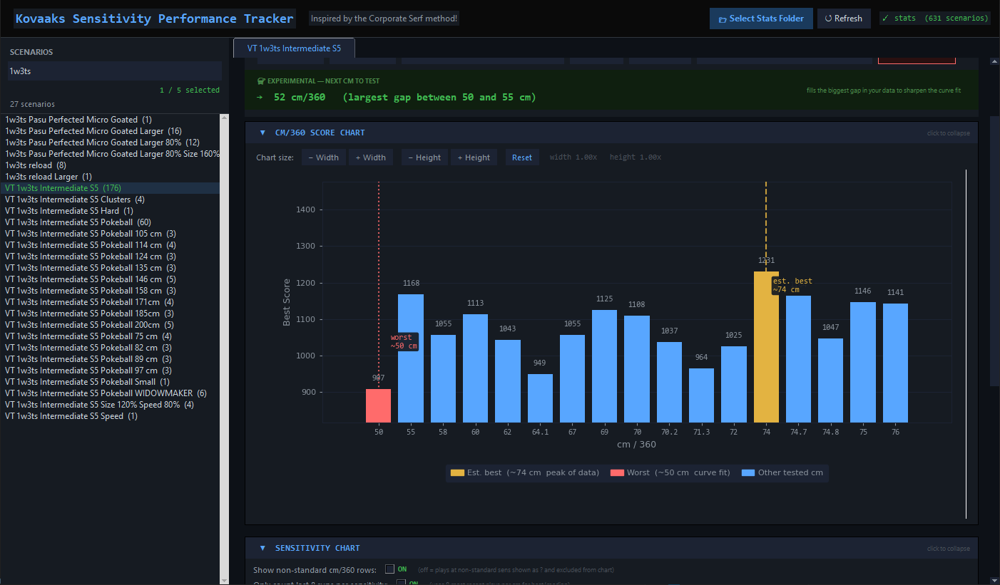
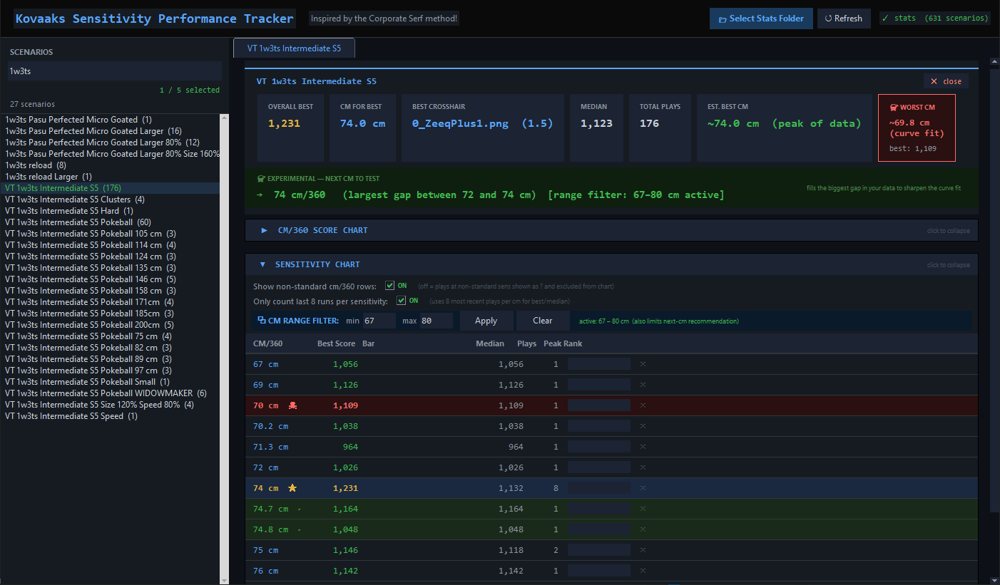
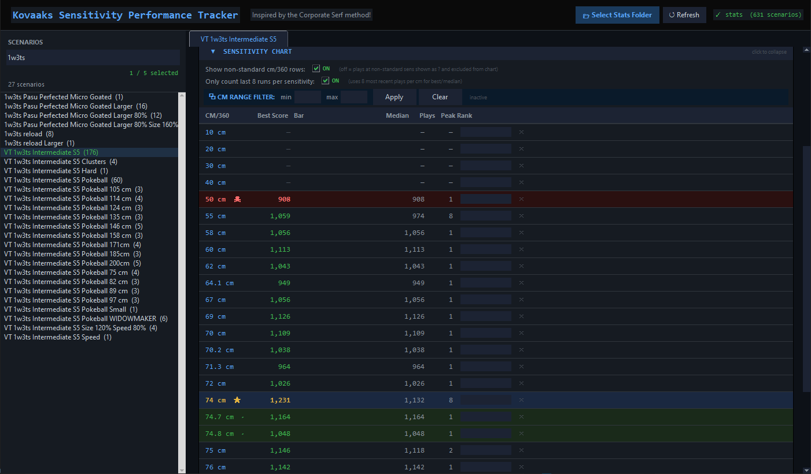

# Mouse Sensitivity Performance Tracker

Windows-focused desktop app for analyzing KovaaK sensitivity training data.

Originally inspired by the Corporate Serf sensitivity method, this tool helps players review performance across multiple sensitivities without manually filling out spreadsheets after every run.

Instead of logging results by hand in a spreadsheet, the app parses KovaaK stats, groups runs by scenario, and surfaces trends through score summaries, recommendations, filtering tools, and embedded charts.

## Status

This project is currently in beta and still under active development.

Current focus areas include:
- improving UI clarity and usability
- refining analysis and recommendation behavior
- polishing public documentation and screenshots
- preparing for a Windows-friendly packaged release

## Why I Built It

The Corporate Serf method is based on the idea that training aim scenarios at different sensitivities can expose specific weaknesses.

For example:
- weaker low-sensitivity performance may point to weaker shoulder-driven aim
- weaker high-sensitivity performance may point to weaker fingertip or fine-control aim

The original workflow often involved manually entering scores into a Google Sheet after each session. I built this app as a desktop alternative that reduces that friction and makes the analysis easier to repeat.

## Features

- Load a KovaaK stats folder and automatically group runs by scenario
- Compare best score, median score, total plays, estimated best cm/360, and estimated worst cm/360
- Recommend the next cm/360 to test based on current data gaps
- Track the best-performing crosshair and crosshair scale from the highest scoring run
- Manually tag runs with cm/360 values when the source CSV does not include them
- Filter by cm/360 range and hide specific cm values per scenario
- Persist local data for repeat analysis workflows
- View embedded charts directly in the desktop interface

## Screenshots

### Main Analysis View
Overview of scenario analysis, summary cards, and next-sensitivity recommendations.



### Chart View
Embedded chart comparing best scores across tested cm/360 values.



### Filtering Workflow
Sensitivity range filtering and analysis workflow for narrowing recommendations.



### Sensitivity Table View
Detailed table view with best score, median, total plays, and peak ranking data.



## Tech Stack

- Python
- tkinter
- Matplotlib

## Project Structure

```text
kovaaks-sens-tracker/
  corporate_serf_tracker/
    __init__.py
    analysis.py
    app.py
    constants.py
    formatting.py
    parsing.py
    storage.py
  assets/
    screenshots/
  main.py
  requirements.txt